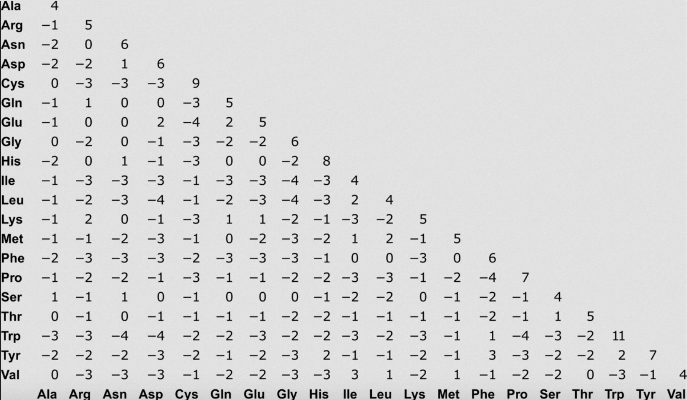
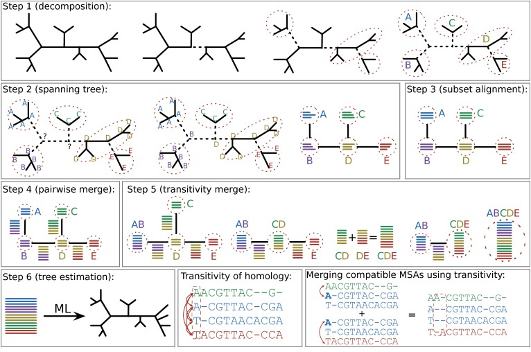

##Overview of multiple sequence alignment

As you have discussed in class, building a phylogeny is dependent on homology.
If we are using character data, typically an expert has assigned homology based on their knowledge of the fossil record, developmental sequence and other sources of information.  

When we are working with molecular data, this is not possible. The goal of multiple sequence alignment (MSA) is to introduce gaps such that each residue in a _column_ will be homologous. At the end of this process, we have a data matrix in which the residues in each column are hypothesized to be descended from a residue in a common ancestor.

This typically takes the form of several possible moves:  
1. Rewarding matches.  
* Add to alignment score  
2. Penalize opening gaps.  
* Decrement score. Typically 5 points to open.   
3. Penalize rare substitutions, but not slight differences.  
* Decrement score.  
4. Penalize extending gaps.  

The alignment that maximizes the total score is considered to be the best. There are multiple ways of achieving an alignment. We will cover three of them today.  

Exercise One & Two on board

We often use what are called _scoring matrices_ to obtain the score of individual substitutions. We will talk about many types of substitution matrices. One that is commonly used in alignment is BLOSUM 62, which is based on empirically-calculated likelihoods of seeing different types of substitutions. 



Exercise 3 and 4 on board.  

As we can see, involving true biological knowledge to score alignments can improve alignment scores, sometimes dramatically!

The three exercises we will do today will focus on different strategies that may be deployed to find the optimal alignment. 

##Progressive MSA

Pairwise Multiple Sequence Alignment does exactly what we discussed above, for all your sequences. Typically, this is performed by first performing a pairwise MSA, as we did above, between the two sequences with the least differences. Then, sequences are added in the order of least differences. Progressive alignments score different alignment possibilities based on the alignment and user-specified scoring matrices, such as BLOSUM 62, or others. Clustal is an example of progressive alignment, but is known to be fairly innaccurate. Below, we use T-COFFEE to get an alignment. 

First, we will download and compile T_Coffee

```
git clone git@github.com:cbcrg/tcoffee.git tcoffee
cd tcoffee
cd compile
make t_coffee
```
We haven't played with any software yet in this class, so I'll now have you create a single location for all your software to live. Change directories into your home. Create a directory called 'bin'. Move the t-coffee executeable into it.

Now, move into the SELUSys repository. Enter the data directory, and the MSALab directory. We'll now run t_coffee on its default settings (a BLOSUM62 matrix with no gap penalty):

```
t_coffee data/sh3.fasta
```
Now, we'll try a gap-opening penalty:

```
t_coffee data/sh3.fasta -matrix blosum62mt -gapopen 5 -outfile=gapopen5
```

And one with a gap-extending penalty: 
```
t_coffee data/sh3.fasta -matrix blosum62mt -gapopen 5 gapextend 5 outfile gapopen5
```

Try one or two more additional alignments, such as increasing the gap open or extension. 

Now, transfer your .aln files to your personal machine using the scp command. Use [Wasabi](http://wasabiapp.org/)to view them.

##Iterative Approaches to MSA

Progressive aligners make a set of assumptions, and apply those assumptions to the whole set of sequences across a phylogeny. But many datasets are fairly large, and may have different evolutionary dynamics across the tree. *Iterative aligners* use tree information to guide the process of making the alignment. 



Now, we will download PASTA:

```unix
git clone https://github.com/smirarab/sate-tools-linux.git
git clone https://github.com/smirarab/pasta.git
```

And we will load a couple libraries required by pasta:
```unix
module load java
module load python/3.5.2-anaconda-tensorflow
```

Now, we build pasta:

```unix
python setup.py develop --user
```

Before you leave the directory, give yourself permission to execute this file. 

We will be submitting these jobs to the nodes of the LONI computer. Change directories back into your home directory.

Now, change directories into your work directory. Create a directory called "lab1", containing three subdirectories: "data", "scripts", and "output".

Enter the SELUSys2018 class directory. In it, there is a directory called scripts. List this directory. If you have a script called "pasta_script1", copy this script into your lab1 scripts directory. If you do not have this file, type

```
git pull
``` 

to update this directory. Move the script into your lab1 scripts directory.

Use a text editor to open pasta_script1. Let's unpack this script together. Feel free to make notes in your script about what different parts mean.

Now, we will run the script. First:

```
qsub -I -V -A loni_selu_sys -q single -l nodes=1:ppn=1,walltime=3:00:00
```

This will place us on a node so we can use lots of memory for this job.

Execute the actual pasta run:

```
python ~/pasta/run_pasta.py -i data/pythonidae.fasta
```

As this runs, we will discuss the output that is appearing to the screen. 

Now, we will look at the output. Create an "exercise_one" directory in the output directory. Move all of the outputs into the exercise_one directory. 

Copy the pastajob.marker001.pythonidae.aln and pastajob_temp_iteration_2_tree.tre into your user home:

```
cp output/exercise_one/pastajob_temp_iteration_2_tree.tre ~/
cp output/exercise_one/pastajob.marker001.pythonidae.aln ~/
```

Now, we will copy these files to our local machine. Open a new terminal window. Navigate to the class repository, and make a lab1 directory, with somewhere to store the output. Change directories into it. Now, we will use secure copy to move the alignment file into our directory:

```
scp <username>@qb2.loni.org:~/pastajob.marker001.pythonidae.aln .
scp <username>@qb2.loni.org:~/pastajob_temp_iteration_2_tree.tre .
```
 

### Choice of Tree Estimator

Pasta allows us to build a tree for iterative estimation in different ways. [FastTree](http://www.microbesonline.org/fasttree/) has some known [accuracy issues](http://journals.plos.org/plosone/article?id=10.1371/journal.pone.0027731). That's probably not an issue for an early stage analysis that will be improved. But let's have a look at what happens if we use a better alignment. 

In the class repository, there is a second script for today, pasta_script2. Copy it into your lab1 folder. Open it in nano. We will need to edit the working directory, and your email address. 

From the lab1 directory, submit the script to the nodes using:

```
qsub pasta_script2
```

You can check on the progress of your job by typing 

```
qstat -u <your username>
```

You'll get output something like this:

```
Req'd   Elap
Job ID               Username    Queue    Jobname          SessID NDS   TSK    Memory Time  S Time
-------------------- ----------- -------- ---------------- ------ ----- ------ ------ ----- - -----
446904.qb3           amwright    workq    binarysims        65908     1     20    --  36:00 R 29:17
447323.qb3           amwright    workq    MSsims           101460     1     20    --  36:00 R 06:59
447478.qb3           amwright    single   pasta             99242     1      1    --  01:00 R 00:01
```

Unfortunately, the way this cluster is configured, you won't see any output from the actual analysis until it finishes running. This analysis will take about ___ minutes.

While it runs, we will set up a new analysis.

### Changing Number of Subsets

Open the Python tree in IcyTree. How many clades do you think are on this tree? What size are they? Make a copy of the pasta_script2 to pasta_script3. Add the option "--max-subproblem-size=", and choose what you think is the maximum clade size on this tree. Edit the jobname to something unique.

### Comparing alignments

As your alignments finish, copy them to your computer - the final alignments will be in the .aln file. We will view our alignment files in [Wasabi](http://wasabiapp.org/), which is a simple-browswer based alignment. 

It can be very hard to appreciate the differences between alignments by eye. We will try making comparisons with [FastSP](https://github.com/smirarab/FastSP), which gives some at-a-glance comparisons.

Change directories back to your home directory. Clone the FastSP software:

```
cd ~/
git clone https://github.com/smirarab/FastSP.git
```
Now, change back to your previous directory with:

```
cd -
```

You can call FastSP like so:

```
java -jar ~/FastSP/FastSP.jar -r reference_alignment_file -e estimated_alignment_file
```

So, for example, if I wanted to compare the alignment I estimated  with Pasta, using FastTree,  and the one with Pasta and Raxml, my command would look like

```
java -jar ~/FastSP/FastSP.jar -r /output/exercise_one/pastajob.marker001.pythonidae.aln -e /output/exercise_two/pastajob.marker001.pythonidae.aln
```

Based on these metrics, which alignment do you prefer? What other information would you want to know before choosing an alignment for your project?


##Coestimation of MSA and Phylogeny

Phylogenetic esitmation generally assumes that we know the alignment without error. We've already seen in our examples cases where we do not get the same alignment between methods. This is particularly true in areas that are hard to align. For example, in the below paper, they estimate a tree for fungi, which are deeply-diverged, and very diverse. The alignment has many problematic regions. What they showed in this paper was that by not accounting for the alignment uncertainty, support was overestimated for their tree hypothesis.


We haven't talked about Bayesian estimation, so I'm going to say very little on joint estimation of alignment and topology. This is a method that allows for a wide range of models to be deployed in order to estimate both the alignment and the tree, and shows great promise for difficult alignment issues. We have a few floating open labs throughout the semester, so if this is a topic of interest to people, we can revisit it then.

The primary software that performs this analysis is [Bali-Phy](http://www.bali-phy.org/Tutorial3.html), which is described [here](http://www.bali-phy.org/Redelings_and_Suchard_2005.pdf).


##References:
* T-Coffee Manual: http://tcoffee.readthedocs.io/en/latest/
* Pasta Algorithm Description: https://www.ncbi.nlm.nih.gov/pmc/articles/PMC4424971/
* Sate Algorithm Description: https://academic.oup.com/sysbio/article/61/1/90/1680002